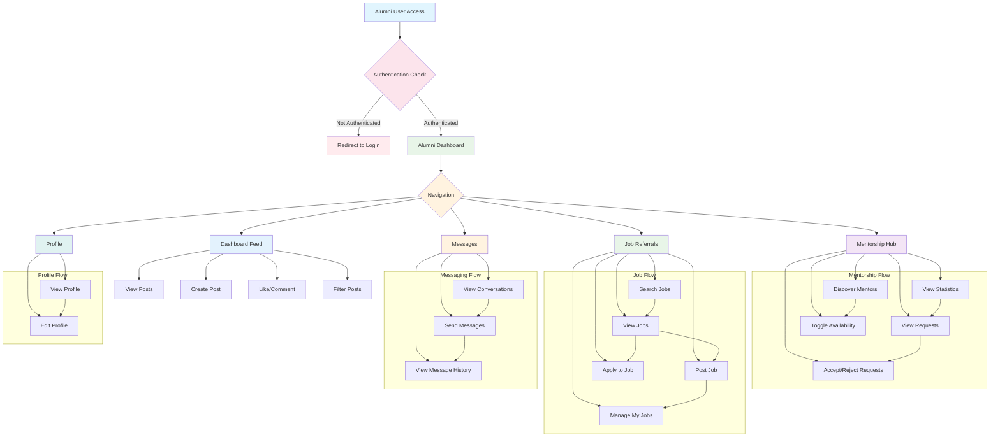

# Alumni System Flow

```mermaid
graph TD
    A[Alumni User Access] --> B{Authentication Check}
    B -->|Not Authenticated| C[Redirect to Login]
    B -->|Authenticated| D[Alumni Dashboard]
    
    D --> E{Navigation}
    E --> F[Dashboard Feed]
    E --> G[Mentorship Hub]
    E --> H[Job Referrals]
    E --> I[Messages]
    E --> J[Profile]
    
    F --> K[View Posts]
    F --> L[Create Post]
    F --> M[Like/Comment]
    F --> N[Filter Posts]
    
    G --> O[View Requests]
    G --> P[Accept/Reject Requests]
    G --> Q[Toggle Availability]
    G --> R[Discover Mentors]
    G --> S[View Statistics]
    
    H --> T[View Jobs]
    H --> U[Post Job]
    H --> V[Apply to Job]
    H --> W[Manage My Jobs]
    H --> X[Search Jobs]
    
    I --> Y[View Conversations]
    I --> Z[Send Messages]
    I --> AA[View Message History]
    
    J --> AB[View Profile]
    J --> AC[Edit Profile]
    
    subgraph "Mentorship Flow"
        O --> P
        R --> Q
        S --> O
    end
    
    subgraph "Job Flow"
        T --> U
        T --> V
        U --> W
        X --> T
    end
    
    subgraph "Messaging Flow"
        Y --> Z
        Z --> AA
    end
    
    subgraph "Profile Flow"
        AB --> AC
    end
    
    style A fill:#e1f5fe
    style B fill:#fce4ec
    style C fill:#ffebee
    style D fill:#e8f5e8
    style E fill:#fff3e0
    style F fill:#e3f2fd
    style G fill:#f3e5f5
    style H fill:#e8f5e8
    style I fill:#fff3e0
    style J fill:#e0f2f1
```

This diagram shows the complete flow of the alumni system from user access through all major features.