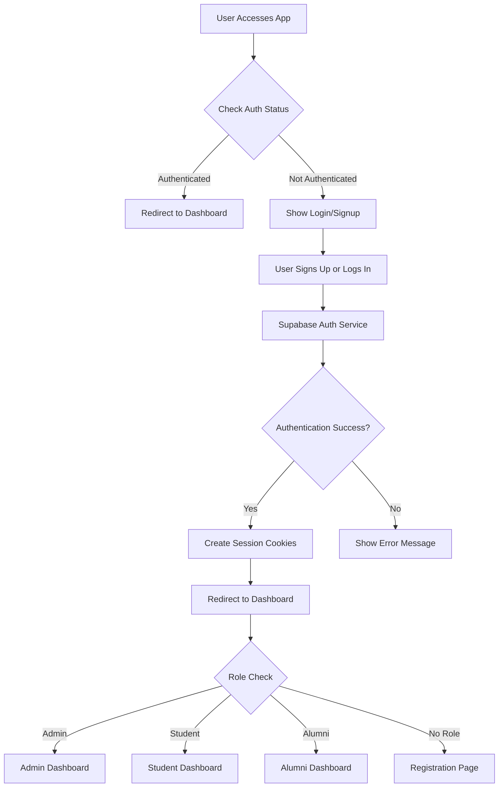

# Minixy Authentication System

This document provides a comprehensive overview of the authentication system in the Minixy Alumni Network Platform. It covers the architecture, flow, components, and implementation details of the authentication mechanism.

## Table of Contents
1. [Overview](#overview)
2. [Authentication Flow](#authentication-flow)
3. [System Architecture](#system-architecture)
4. [Core Components](#core-components)
5. [Auth Utils Deep Dive](#auth-utils-deep-dive)
6. [JavaScript Usage in Authentication](#javascript-usage-in-authentication)
7. [Security Features](#security-features)
8. [Session Management](#session-management)

## Overview

The Minixy authentication system is built using FastAPI with Supabase as the backend authentication provider. It implements a comprehensive authentication flow that includes user signup, login, session management, role-based access control, and secure token handling.

Key features:
- Email/password authentication with Supabase
- JWT-based session management
- Automatic token refresh
- Role-based access control (RBAC)
- Secure cookie handling
- Input validation and sanitization

## Authentication Flow



### Detailed Flow Steps:

1. **Initial Access**: When a user accesses the application, the system checks for existing session cookies
2. **Authentication Check**: Uses `get_current_user()` to validate session tokens
3. **Redirect Logic**: Authenticated users are redirected to their role-specific dashboard
4. **Signup/Login**: Unauthenticated users can sign up or log in via forms
5. **Supabase Integration**: Credentials are validated against Supabase Auth service
6. **Session Creation**: On successful authentication, secure cookies are set
7. **Role Assignment**: User role is determined and used for dashboard routing
8. **Auto-refresh**: Session tokens are automatically refreshed when needed

## System Architecture

The authentication system follows a layered architecture pattern:

```
┌─────────────────┐    ┌──────────────────┐    ┌──────────────────┐
│   Templates     │    │   Controllers    │    │    Services      │
│ (login.html,    │◄──►│ (auth_controller)│◄──►│ (auth_services)  │
│  signup.html)   │    │                  │    │                  │
└─────────────────┘    └──────────────────┘    └──────────────────┘
                                │                         │
                                ▼                         ▼
                        ┌──────────────────┐    ┌──────────────────┐
                        │  Auth Utils      │    │  Repositories    │
                        │ (auth_utils.py)  │    │(auth_repository) │
                        └──────────────────┘    └──────────────────┘
                                │                         │
                                ▼                         ▼
                        ┌──────────────────────────────────────────┐
                        │           Supabase Auth Service          │
                        └──────────────────────────────────────────┘
```

## Core Components

### 1. Auth Controller (`src/controllers/auth_controller.py`)

Handles all HTTP requests related to authentication:
- `/login` - GET/POST for login page and authentication
- `/signup` - GET/POST for user registration
- `/api/login` - API endpoint for login processing
- `/api/signup` - API endpoint for signup processing
- `/logout` - Session termination
- `/dashboard` - Dashboard routing based on user role
- Role-specific dashboard routes (admin, student, alumni)

### 2. Auth Service (`src/services/auth_services.py`)

Business logic layer that acts as an intermediary between controllers and repositories:
- `signup_user()` - User registration
- `login_user()` - User authentication
- `current_user()` - Get current user information
- `logout_user()` - Terminate user session
- `refresh_token()` - Refresh session tokens
- `reset_password()` - Initiate password reset
- `update_password()` - Update user password

### 3. Auth Repository (`src/repositories/auth_repository.py`)

Data access layer that communicates directly with Supabase:
- `signup_user()` - Register user with Supabase Auth
- `login_user()` - Authenticate user with Supabase Auth
- `current_user()` - Get user info using access token
- `logout_user()` - Sign out from Supabase
- `refresh_token()` - Refresh session with Supabase
- `reset_password()` - Send password reset email
- `update_password()` - Update password in Supabase

### 4. Validators (`src/validators.py`)

Input validation and security utilities:
- `AuthValidator` - Email, password, and name validation
- `SecurityHelper` - Token security checks and role validation

## Auth Utils Deep Dive

The `src/auth_utils.py` file contains critical authentication utilities:

### 1. `get_current_user(request, response)`

Retrieves and validates the current authenticated user:
- Extracts session and refresh tokens from cookies
- Validates session token security using `SecurityHelper.is_secure_session_token()`
- Uses `AuthService.current_user()` to get user info from Supabase
- Automatically refreshes expired tokens using refresh tokens
- Sets refreshed tokens in response cookies
- Retrieves and attaches user role to the request state

```python
async def get_current_user(request: Request, response: Optional[Response] = None):
    session_token = request.cookies.get('user_session')
    refresh_token = request.cookies.get('refresh_token')
    
    # ... validation and token refresh logic ...
    
    # Attach user and role to request state
    request.state.user = user
    request.state.user_role = user_role
    
    return user
```

### 2. `protected_route(allowed_roles)`

Decorator for protecting web routes with role-based access control:
- Wraps route handlers to enforce authentication
- Redirects unauthenticated users to login page
- Checks user roles against allowed roles
- Returns appropriate HTTP responses for unauthorized access

```python
def protected_route(allowed_roles=None):
    def decorator(func):
        @wraps(func)
        async def wrapper(request: Request, *args, **kwargs):
            # ... authentication and authorization logic ...
            return await func(request, *args, **kwargs)
        return wrapper
    return decorator
```

### 3. `protected_api_route(allowed_roles)`

Similar to `protected_route` but designed for API endpoints:
- Returns JSON responses instead of redirects
- Raises HTTP exceptions for authentication/authorization failures
- Suitable for AJAX/API calls

### 4. `create_session_cookies(response, access_token, refresh_token, role)`

Creates secure HTTP-only cookies for session management:
- Sets appropriate cookie security flags (HttpOnly, Secure, SameSite)
- Configures different expiration times based on user role
- Handles both access and refresh tokens

```python
def create_session_cookies(response: Response, access_token: str, 
                          refresh_token: Optional[str] = None, 
                          role: Optional[str] = None):
    session_max_age = 604800 if role == 'admin' else 3600  # 7 days for admin, 1 hour for others
    refresh_max_age = 2592000  # 30 days for refresh token
    
    response.set_cookie(
        key="user_session",
        value=access_token,
        httponly=True,
        secure=True,
        samesite='lax',
        max_age=session_max_age
    )
    # ... refresh token cookie ...
```

### 5. `clear_session_cookies(response)`

Removes authentication cookies to log out users:
- Deletes both session and refresh token cookies
- Used during logout operations

## JavaScript Usage in Authentication

The Minixy authentication system primarily uses server-side form submissions rather than client-side JavaScript for the core authentication flows. However, there are some client-side enhancements:

### 1. Form Submission Enhancement

While the authentication forms in [login.html](file:///e%3A/minixy/templates/login.html) and [signup.html](file:///e%3A/minixy/templates/signup.html) use standard HTML form submissions, the templates include CSS animations and transitions that enhance the user experience:

```html
<!-- Form submission uses standard POST to server -->
<form class="auth-form" action="/api/login" method="post">
    <div class="form-group">
        <input name="email" type="email" class="form-control" placeholder="Enter your email" required />
    </div>
    <div class="form-group">
        <input name="password" type="password" class="form-control" placeholder="Enter your password" required />
    </div>
    <button type="submit" class="btn">Sign in to Minixy</button>
</form>
```

### 2. UI Enhancements

The authentication templates use CSS animations for:
- Floating background shapes
- Button hover effects
- Form input focus states
- Success/error message animations
- Tab transitions

These are purely visual enhancements and don't affect the authentication logic.

### 3. Progressive Enhancement Opportunities

While not currently implemented, the system could be enhanced with JavaScript for:
- Form validation before submission
- Real-time password strength checking
- Auto-focus on form fields
- Loading indicators during authentication

## Security Features

### 1. Input Validation and Sanitization

All user inputs are validated and sanitized:
- Email format validation
- Password complexity requirements
- Name length and character validation
- HTML/JavaScript injection prevention

### 2. Token Security

- Session tokens are validated for security before use
- Refresh tokens are stored securely in HTTP-only cookies
- Tokens are automatically refreshed when needed

### 3. Role-Based Access Control

- Users are assigned roles (admin, student, alumni)
- Routes are protected based on role requirements
- Unauthorized access attempts are properly handled

### 4. Secure Cookie Handling

- HTTP-only cookies prevent XSS attacks
- Secure flags ensure cookies are only sent over HTTPS
- SameSite attribute prevents CSRF attacks
- Appropriate expiration times based on user role

## Session Management

### Token Lifecycle

1. **Access Token**: Short-lived token (1 hour for regular users, 7 days for admins)
2. **Refresh Token**: Long-lived token (30 days) used to obtain new access tokens
3. **Automatic Refresh**: Expired access tokens are automatically refreshed using refresh tokens
4. **Graceful Expiration**: Users are redirected to login when sessions expire

### Session States

- **Active**: Valid session with current user information
- **Expired**: Access token expired, but refresh token valid
- **Terminated**: Both tokens invalid, user logged out

## Implementation Details

### Environment Variables

The authentication system requires the following environment variables:
- `SUPABASE_URL`: Supabase project URL
- `SUPABASE_KEY`: Supabase API key

### Error Handling

Comprehensive error handling for:
- Invalid credentials
- Network issues with Supabase
- Token validation failures
- Role validation errors
- Session expiration

### Testing

The authentication system can be tested by:
1. Accessing the login page at `/login`
2. Creating a new account via `/signup`
3. Verifying session creation and cookie setting
4. Testing role-based access to protected routes
5. Verifying logout functionality

## Conclusion

The Minixy authentication system provides a robust, secure, and user-friendly authentication experience. It leverages Supabase for reliable authentication services while implementing additional security measures and user experience enhancements through FastAPI and custom utilities.