# Student System Architecture

This document provides a comprehensive overview of the student system architecture, including component relationships, data flow, and technology stack.

## System Architecture Overview

The student system follows a layered architecture pattern that separates concerns and promotes maintainability. The architecture consists of the following layers:

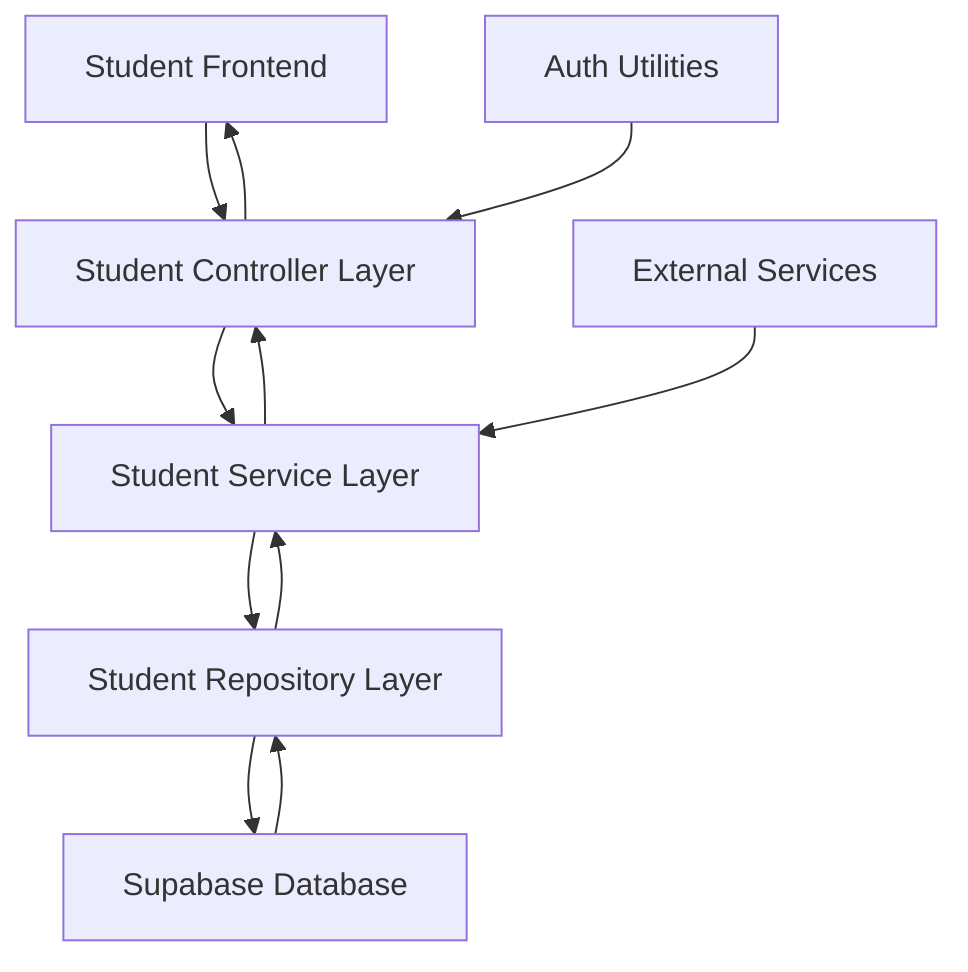

## Component Architecture

### 1. Frontend Layer

The frontend layer consists of HTML templates rendered with Jinja2, enhanced with JavaScript for dynamic interactions:

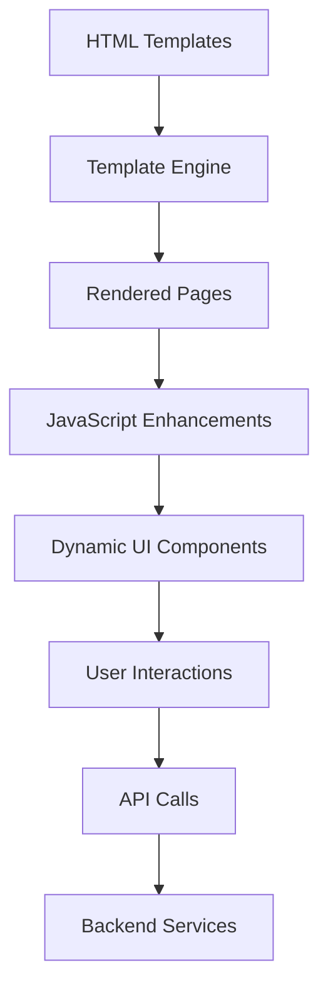

#### Key Frontend Components:
- **Student Dashboard Template** ([studentdashboard.html](templates/studentdashboard.html))
- **Mentorship Hub Template** ([studentmentor.html](templates/studentmentor.html))
- **Job Opportunities Template** ([student_job.html](templates/student_job.html))
- **Messaging Template** ([student_messages.html](templates/student_messages.html))
- **Profile Template** ([student_profile.html](templates/student_profile.html))

#### Frontend Technologies:
- HTML5 with semantic markup
- TailwindCSS for styling
- JavaScript (ES6+) for interactivity
- Font Awesome for icons
- Responsive design principles

### 2. Controller Layer

The controller layer handles HTTP requests and responses, routing them to appropriate services:

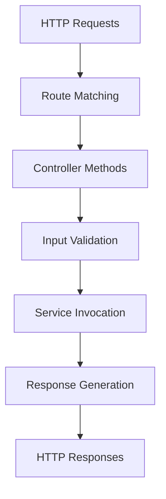

#### Key Controller Components:
- **Student Controller** ([student_controller.py](src/controllers/student_controller.py))
- **Auth Utilities** ([auth_utils.py](src/auth_utils.py))

#### Controller Responsibilities:
- Request routing and handling
- Input validation and sanitization
- Authentication and authorization
- Response formatting
- Error handling

### 3. Service Layer

The service layer implements business logic and coordinates between controllers and repositories:

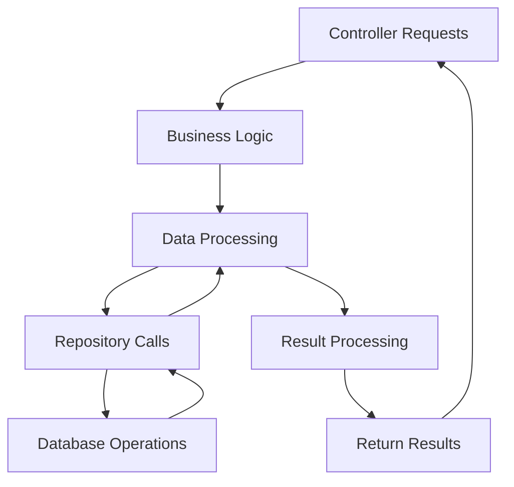

#### Key Service Components:
- **Student Services** ([student_services.py](src/services/student_services.py))
- **Mentorship Services** ([mentorship_services.py](src/services/mentorship_services.py))
- **Job Services** ([student_job_services.py](src/services/student_job_services.py))
- **Messaging Services** ([messages_services.py](src/services/messages_services.py))
- **Profile Services** ([profile_services.py](src/services/profile_services.py))

#### Service Responsibilities:
- Business rule implementation
- Data validation and transformation
- Coordination between repositories
- External service integration
- Transaction management

### 4. Repository Layer

The repository layer manages data access and persistence:

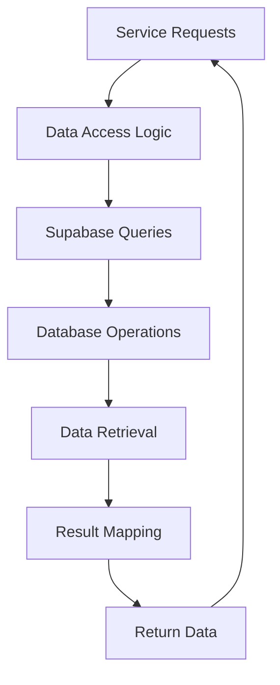

#### Key Repository Components:
- **Student Repository** ([student_repository.py](src/repositories/student_repository.py))
- **Mentorship Repository** ([mentorship_repository.py](src/repositories/mentorship_repository.py))
- **Job Repository** ([student_job_repository.py](src/repositories/student_job_repository.py))
- **Messages Repository** ([messages_repository.py](src/repositories/messages_repository.py))
- **Profile Repository** ([profile_repository.py](src/repositories/profile_repository.py))

#### Repository Responsibilities:
- Database query execution
- Data mapping and transformation
- Connection management
- Caching strategies
- Performance optimization

### 5. Database Layer

The database layer provides data persistence using Supabase (PostgreSQL):

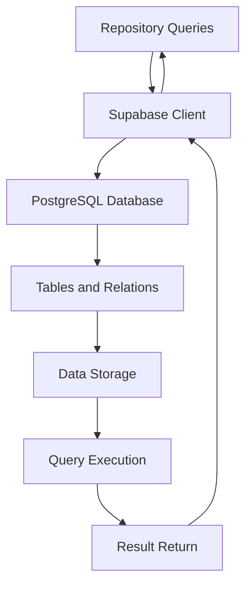

#### Key Database Components:
- **Users Table** - Student and alumni profiles
- **Posts Table** - Community feed content
- **Mentor Requests Table** - Mentorship requests
- **Jobs Table** - Job listings
- **Conversations Table** - Messaging conversations
- **Messages Table** - Individual messages
- **Profiles Table** - Detailed user information

## Data Flow Architecture

### 1. Student Dashboard Data Flow

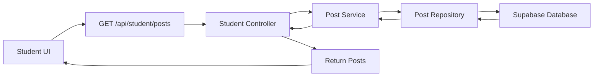

### 2. Mentorship Request Data Flow

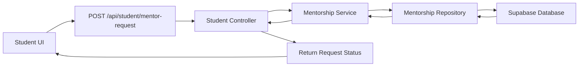

### 3. Job Application Data Flow

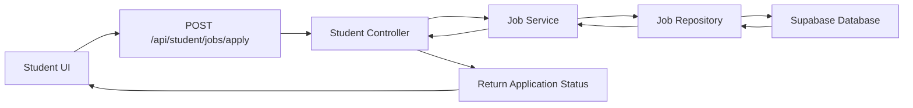

## Technology Stack

### Frontend Technologies
- **HTML5** - Semantic markup and structure
- **TailwindCSS** - Utility-first CSS framework
- **JavaScript (ES6+)** - Client-side interactivity
- **Font Awesome** - Icon library
- **Jinja2** - Template engine

### Backend Technologies
- **Python 3.8+** - Primary programming language
- **FastAPI** - Web framework for building APIs
- **Supabase** - Backend-as-a-Service (PostgreSQL database)
- **JWT** - Authentication tokens
- **python-dotenv** - Environment variable management

### Infrastructure
- **Supabase Platform** - Hosting and database services
- **RESTful API Design** - Standardized API communication
- **HTTPS** - Secure communication protocol

## Security Architecture

### Authentication Flow

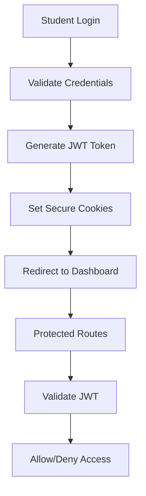

### Authorization Layers

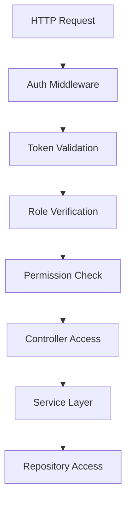

## Performance Architecture

### Caching Strategy

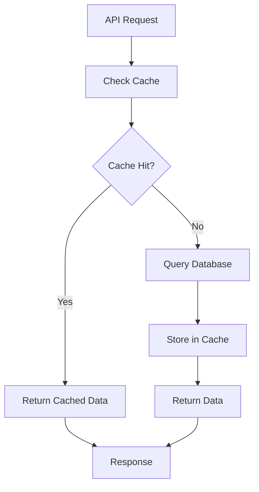

### Load Distribution

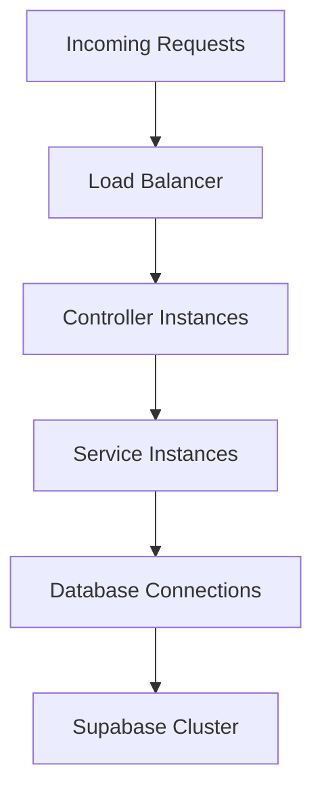

## Scalability Considerations

### Horizontal Scaling

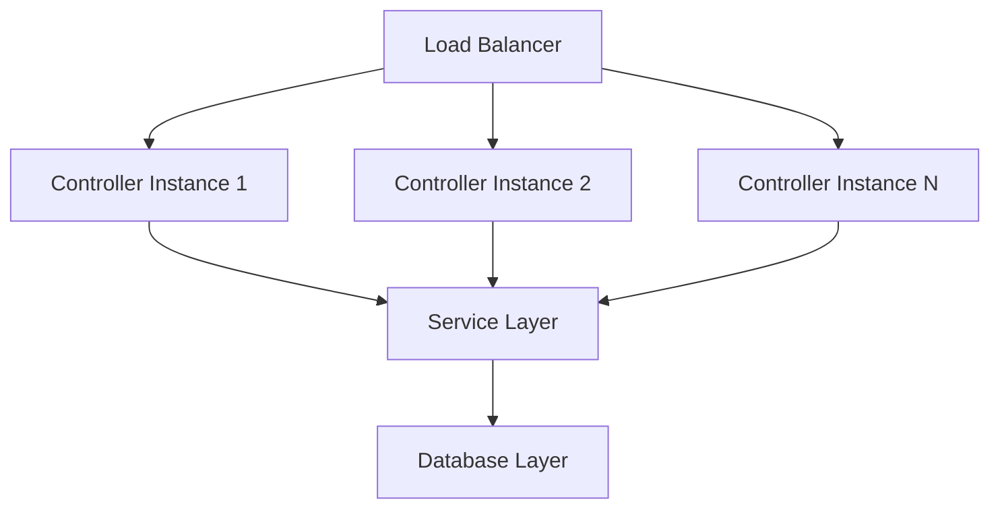

### Database Optimization

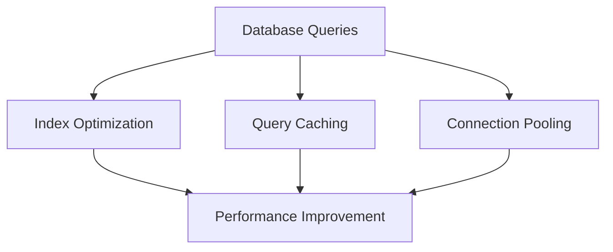

## Monitoring and Logging

### Error Handling Flow

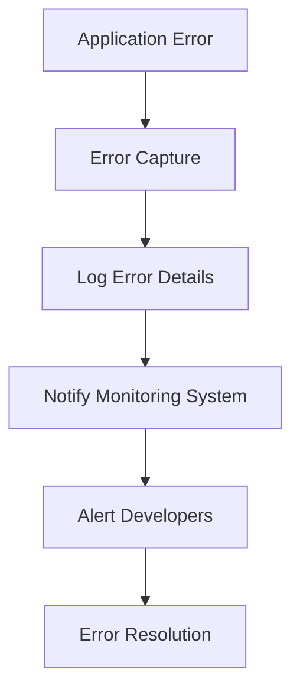

### Performance Monitoring

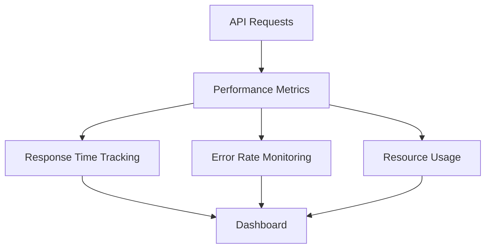

## Conclusion

The student system architecture is designed to be modular, scalable, and maintainable. The layered approach ensures separation of concerns, making it easier to develop, test, and deploy individual components. The use of modern technologies and best practices ensures a robust and performant system that can scale with growing user demands.

The architecture supports both current requirements and future enhancements, with clear boundaries between components that allow for independent development and deployment.