# Student System Flow Diagram

This document provides a visual representation of the student system's user flows and component interactions.

## User Journey Flows

### 1. Student Login and Dashboard Access

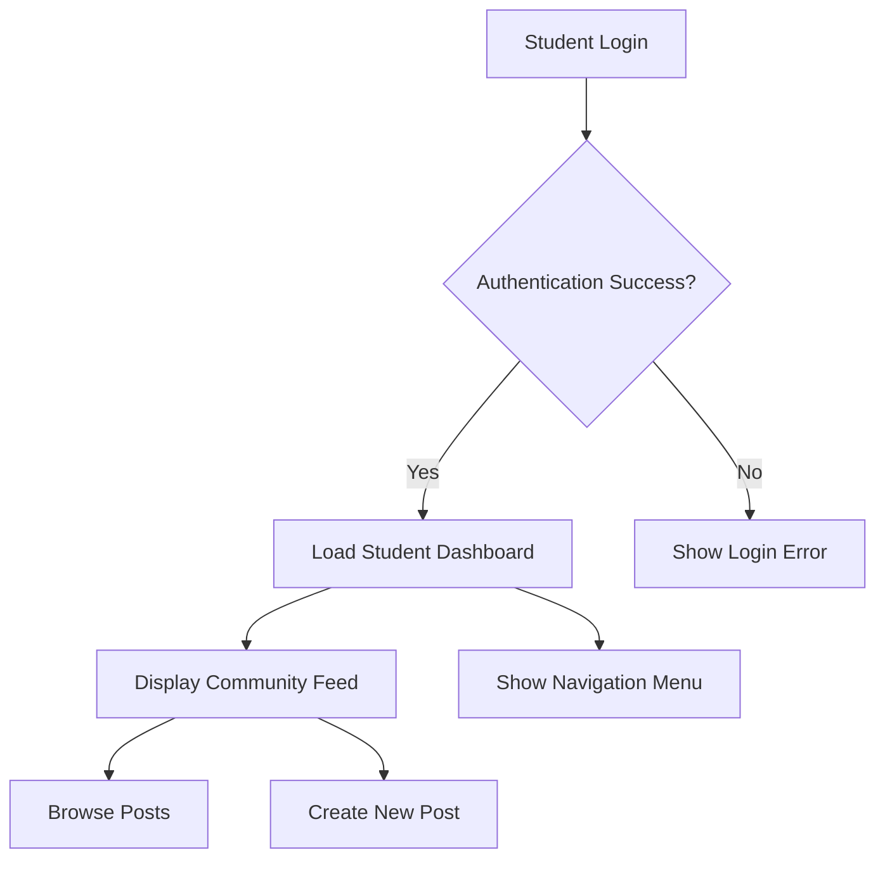

### 2. Community Feed Interaction

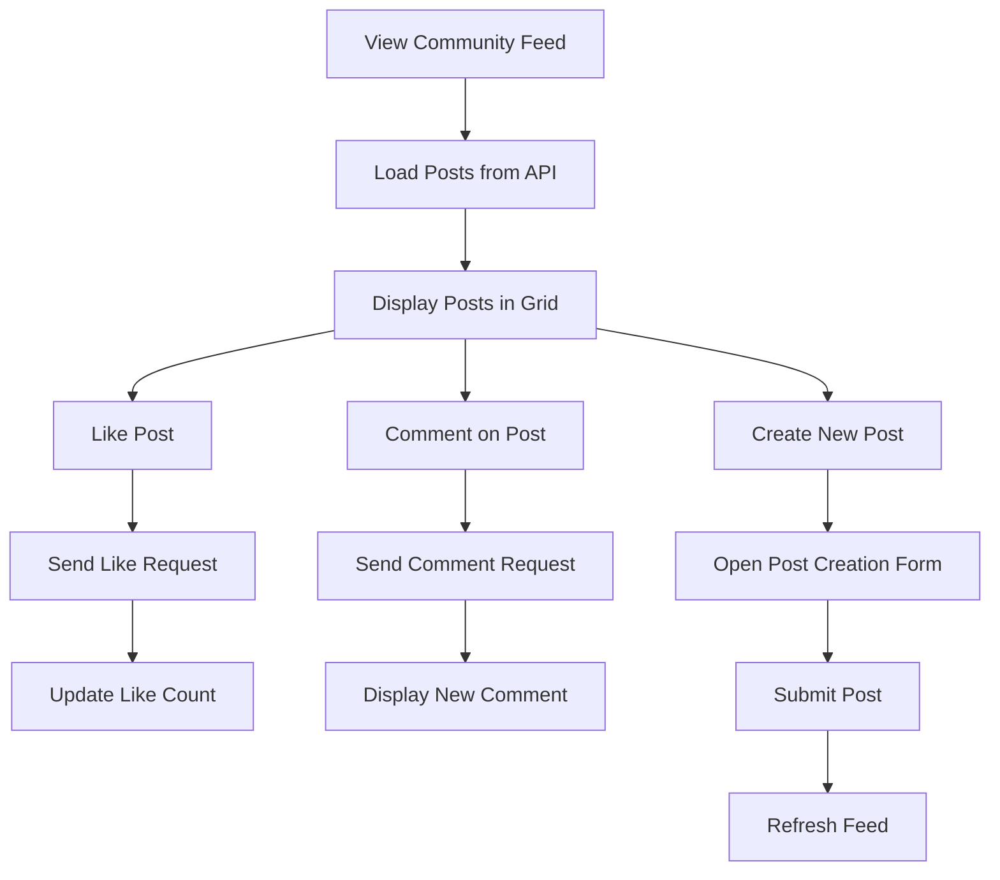

### 3. Mentorship Hub Flow

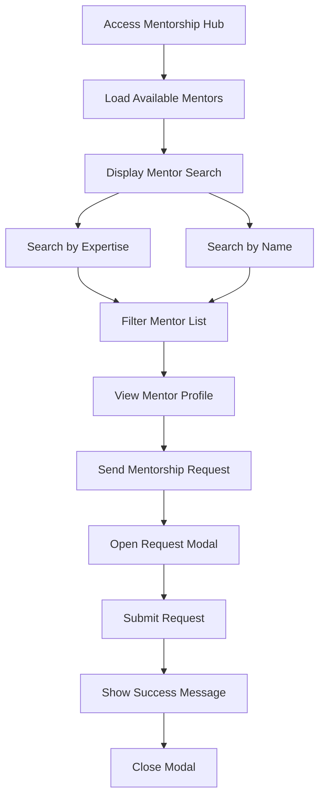

### 4. Job Opportunities Flow

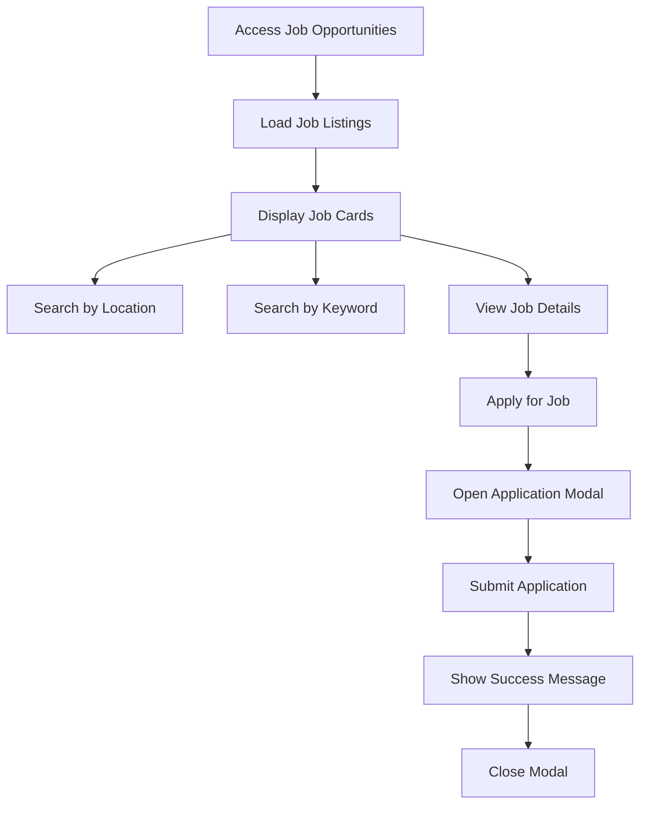

### 5. Messaging System Flow

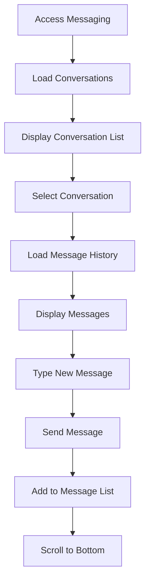

### 6. Profile Management Flow

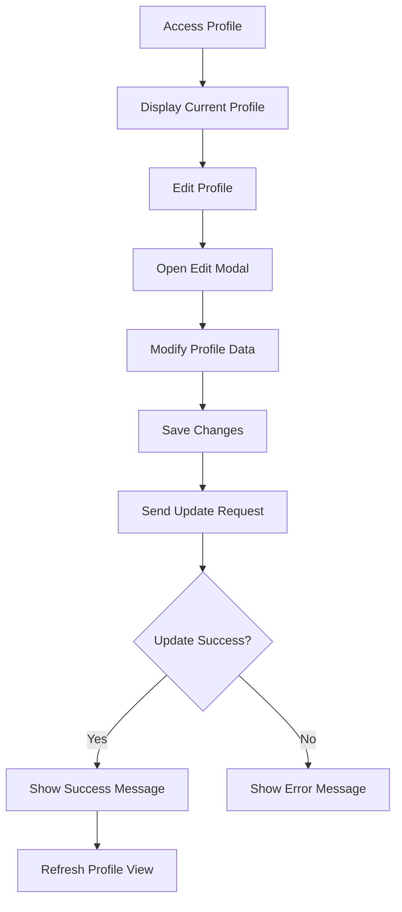

## Component Interaction Diagram

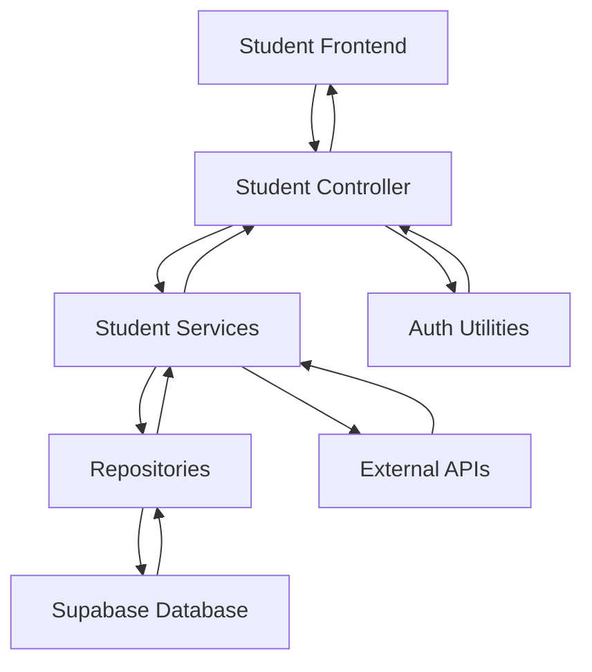

## Data Flow Patterns

### 1. Post Creation Flow

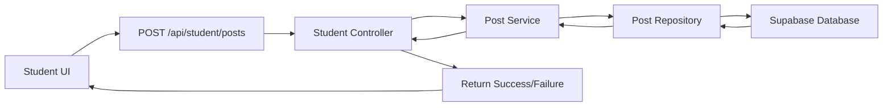

### 2. Mentor Request Flow

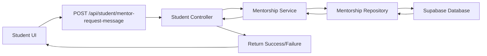

### 3. Job Application Flow

```mermaid
graph LR
    A[Student UI] --> B[POST /api/student/jobs/{id}/apply]
    B --> C[Student Controller]
    C --> D[Job Service]
    D --> E[Job Repository]
    E --> F[Supabase Database]
    F --> E
    E --> D
    D --> C
    C --> G[Return Success/Failure]
    G --> A
```

## Authentication Flow

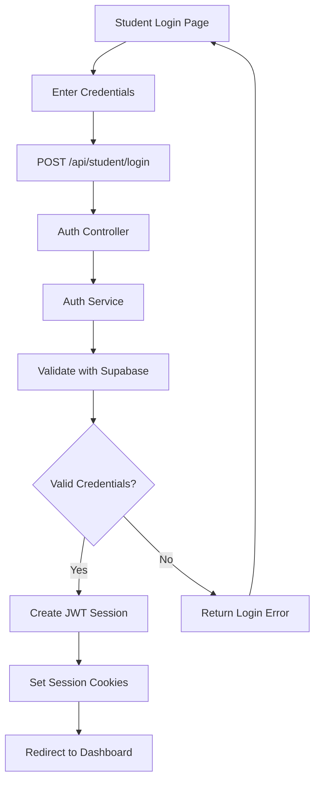

## Error Handling Flows

### 1. API Error Handling

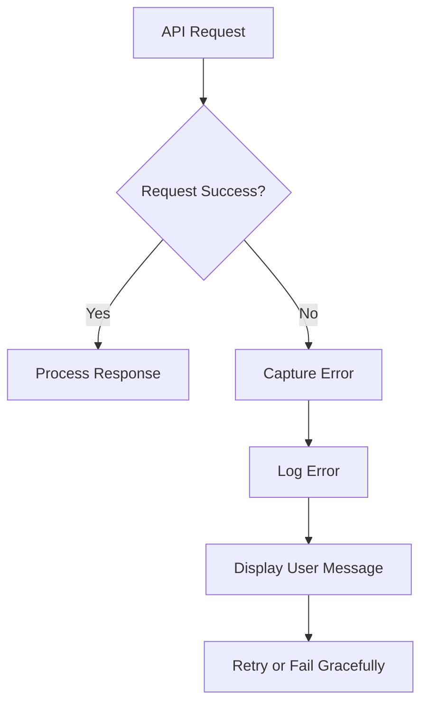

### 2. Form Validation Flow

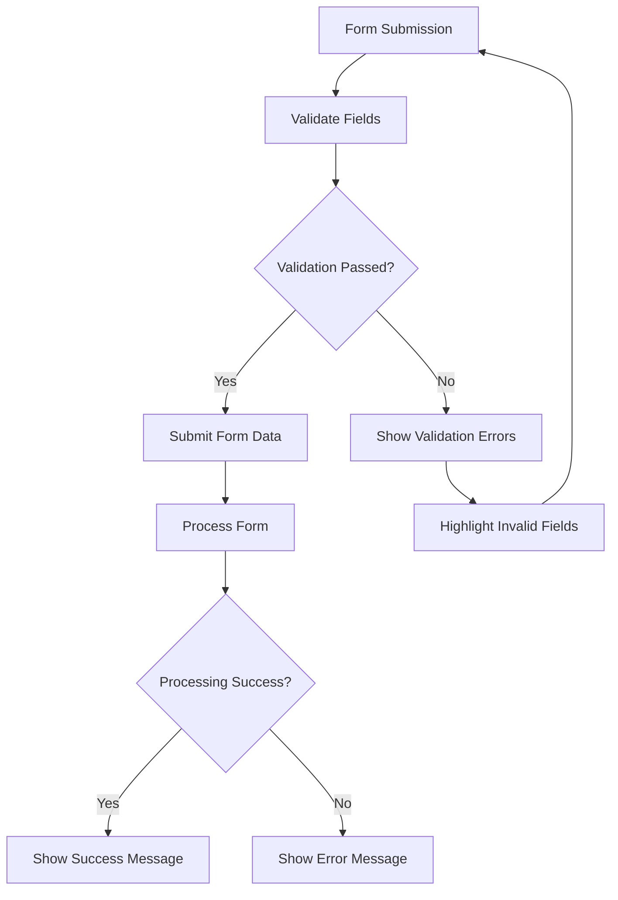

## Mobile Responsiveness Flow

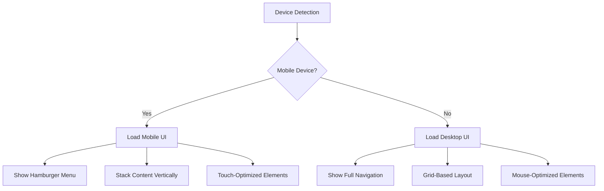

## Conclusion

These flow diagrams illustrate the various user journeys and system interactions within the student system. They provide a clear understanding of how students navigate through different features and how data flows between components. This visualization helps in identifying potential bottlenecks, improving user experience, and maintaining consistency across the platform.